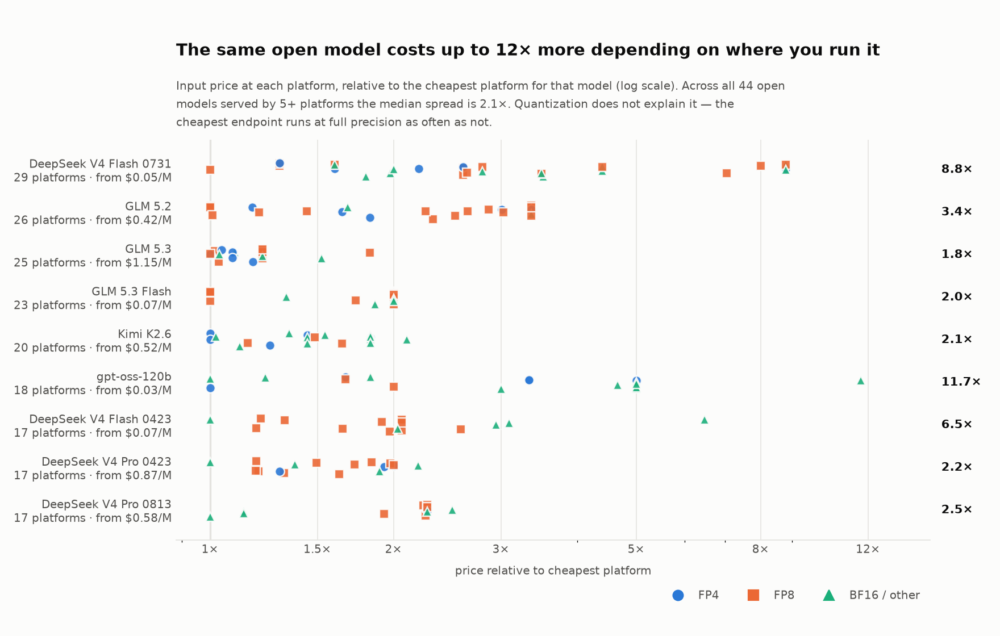
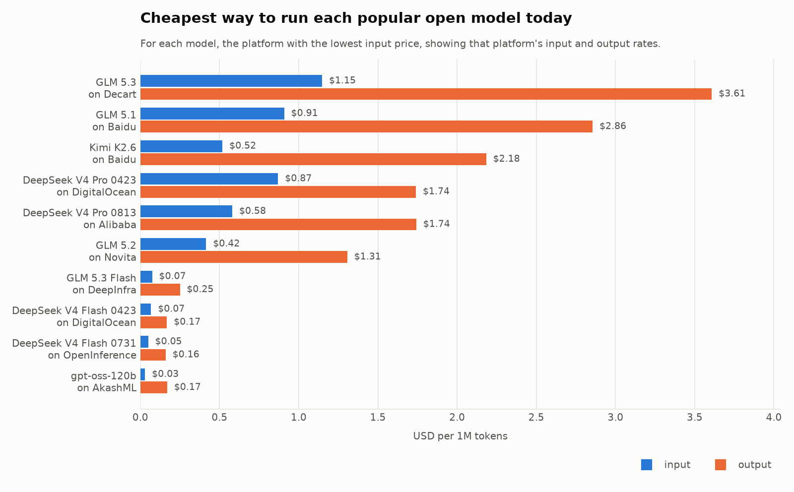

# LLM Price Index

**A public, machine-readable record of what LLM inference actually costs — and how that price changes over time.** Refreshed every 6 hours.

<!-- BEGIN STATS -->
**13,392** price points · **887** models · **73** platforms · updated **2026-09-03 18:34 UTC** · history since **2026-09-02** (2 snapshots)
<!-- END STATS -->

Every provider publishes today's price. **Nobody publishes yesterday's.** This repo
fixes that by writing the number down every 6 hours, in git, forever.

---

## Same model, very different price

<picture>
  <source media="(prefers-color-scheme: dark)" srcset="charts/dispersion-dark.png">
  
</picture>

Open-weight models are served by dozens of platforms at wildly different prices for
what is nominally the same set of weights. Across the 44 open models served by 5 or
more platforms, the **median spread is 2.0×** and **48% of models span more than 2×**.

The obvious explanation — cheap endpoints are quantized harder — **does not hold**. Of
those 44 models, the cheapest endpoint runs at full BF16 precision in 20 cases, more
often than FP8 (14) or FP4 (10). The most expensive endpoint is the BF16 one in 31 of
44. What you are mostly paying for is hardware, margin and throughput: the priciest
gpt-oss-120b endpoint is Cerebras at 11.7× the cheapest, and it is selling speed, not
precision. The chart marks quantization by shape and colour so you can check this
yourself.

## What it costs to run each model today

<picture>
  <source media="(prefers-color-scheme: dark)" srcset="charts/cheapest-dark.png">
  
</picture>

<!-- BEGIN TABLE -->
| Model | Platforms | Cheapest | Input $/M | Output $/M | Spread |
|---|--:|---|--:|--:|--:|
| DeepSeek: DeepSeek V4 Flash 0731 | 29 | [OpenInference](https://www.openinference.ai/) | $0.05 | $0.16 | 8.8× |
| Z.ai: GLM 5.2 | 26 | [Novita](https://novita.ai/) | $0.42 | $1.31 | 3.4× |
| Z.ai: GLM 5.3 | 25 | [Decart](https://cogito.decart.ai/) | $1.15 | $3.61 | 1.8× |
| Z.ai: GLM 5.3 Flash | 23 | [DeepInfra](https://deepinfra.com/) | $0.07 | $0.25 | 2.0× |
| MoonshotAI: Kimi K2.6 | 20 | [Baidu](https://intl.cloud.baidu.com/) | $0.52 | $2.18 | 2.1× |
| OpenAI: gpt-oss-120b | 18 | [AkashML](https://akashml.com/) | $0.03 | $0.17 | 11.7× |
| DeepSeek: DeepSeek V4 Flash 0423 | 17 | [DigitalOcean](https://www.digitalocean.com/) | $0.07 | $0.17 | 6.5× |
| DeepSeek: DeepSeek V4 Pro 0423 | 17 | [DigitalOcean](https://www.digitalocean.com/) | $0.87 | $1.74 | 2.2× |
| DeepSeek: DeepSeek V4 Pro 0813 | 17 | [Alibaba](https://www.alibabacloud.com/) | $0.58 | $1.74 | 2.5× |
| Z.ai: GLM 5.1 | 16 | [Baidu](https://intl.cloud.baidu.com/) | $0.91 | $2.86 | 1.7× |
| DeepSeek: DeepSeek V3.2 | 15 | [GMICloud](https://gmicloud.ai/) | $0.21 | $0.31 | 14.4× |
| MoonshotAI: Kimi K2.7 Code | 15 | [Inceptron](https://www.inceptron.io/) | $0.66 | $3.40 | 1.4× |
| MoonshotAI: Kimi K3 | 15 | [Morph](https://morphllm.com/) | $2.50 | $14.00 | 1.4× |
| Google: Gemma 4 31B | 14 | [DeepInfra](https://deepinfra.com/) | $0.09 | $0.38 | 11.0× |
| OpenAI: gpt-oss-20b | 13 | [AkashML](https://akashml.com/) | $0.02 | $0.10 | 3.8× |
<!-- END TABLE -->

## Biggest price moves

<!-- BEGIN MOVES -->
| Date | Model | Platform | Metric | Old | New | Change |
|---|---|---|---|--:|--:|--:|
| 2026-09-03 | Z.ai: GLM 5.2 | [Baidu](https://intl.cloud.baidu.com/) | input | $0.41 | $1.40 | +237.8% |
| 2026-09-03 | Z.ai: GLM 5.2 | [Baidu](https://intl.cloud.baidu.com/) | output | $1.30 | $4.40 | +237.8% |
| 2026-09-03 | Z.ai: GLM 5.2 | [Baidu](https://intl.cloud.baidu.com/) | cache_read | $0.08 | $0.26 | +237.8% |
| 2026-09-03 | Qwen: Qwen3.8 27B | [Reka](https://reka.ai/) | cache_read | $0.05 | $0.15 | +200.0% |
| 2026-09-03 | DeepSeek: DeepSeek V4 Flash 0731 | [Baidu](https://intl.cloud.baidu.com/) | input | $0.06 | $0.14 | +115.5% |
| 2026-09-03 | DeepSeek: DeepSeek V4 Flash 0731 | [Baidu](https://intl.cloud.baidu.com/) | output | $0.13 | $0.28 | +115.5% |
| 2026-09-03 | DeepSeek: DeepSeek V4 Flash 0731 | [Baidu](https://intl.cloud.baidu.com/) | cache_read | $0.01 | $0.03 | +115.5% |
| 2026-09-02 | DeepSeek: DeepSeek V4 Flash 0731 | [DeepSeek](https://deepseek.com/) | input | $0.22 | $0.44 | +100.0% |
| 2026-09-02 | DeepSeek: DeepSeek V4 Flash 0731 | [DeepSeek](https://deepseek.com/) | output | $0.66 | $1.32 | +100.0% |
| 2026-09-02 | DeepSeek: DeepSeek V4 Flash 0731 | [DeepSeek](https://deepseek.com/) | cache_read | $0.01 | $0.01 | +100.0% |
<!-- END MOVES -->

---

## Subscribe

Price changes are published as an **[Atom feed](https://tokencanopy.github.io/price/feed.xml)** —
one entry per move, or a single summary entry when a platform reprices its whole catalogue.

```
https://tokencanopy.github.io/price/feed.xml
```

Drop that into any feed reader, or into a Slack or Discord channel with
`/feed subscribe <url>` to get price-drop alerts where your team already works. The feed
stores nothing about who is reading it — there is no subscriber list.

## Why this exists

OpenRouter already answers "what does this model cost right now, on 105 platforms",
and it does it well — this repo uses it as a primary source rather than competing with
it. What no public API answers is **"what did it cost last month?"**

Price history is the one dataset that cannot be backfilled. It only exists if somebody
starts writing it down. So: every 6 hours, fetch, diff, commit.

## The data

| File | What |
|---|---|
| `data/current/prices.csv` | Today's normalized snapshot, long format, one row per price |
| `data/history/price_changes.csv` | **Append-only change log** — a row only when a price actually moves |
| `data/current/providers.csv` | Platform → verified homepage, status page, HQ |
| `data/raw/` | Verbatim provider payloads, so any parsing error can be re-run against the original |

Prices move rarely, so the change log stays small while still reconstructing a full
step-function series for any key. To rebuild a series, take the change rows for a key
in `observed_at` order — each row holds the value from that moment until the next.

**Schema** (`prices.csv`): `collected_at, source, platform, model_key, model_name,
author, open_weight, variant, region, metric, usd_per_1m, context_length, effective_date`

- `metric` — `input` · `output` · `cache_read` · `cache_write`
- `variant` — quantization (`fp8`, `fp4`, …) for inference platforms; tier
  (`standard`, `batch`, `priority`) for cloud providers
- `model_key` — Hugging Face repo id for open-weight models, so the same model joins
  across platforms without fuzzy name matching
- All prices are **USD per 1,000,000 tokens**

## Sources

| Source | Auth | Coverage |
|---|---|---|
| OpenRouter | none | ~105 platforms, per-model per-provider pricing incl. quantization |
| AWS Bedrock Price List API | none | Per-region, plus batch / priority tiers OpenRouter does not expose |
| Azure Retail Prices API | none | Foundry Models meters |
| Google Vertex AI | _planned_ | Billing Catalog API needs a free API key |

Every platform below links to its own site where we could verify one resolves, and
to its OpenRouter page otherwise. The mapping lives in `data/current/providers.csv`.

<!-- BEGIN PLATFORMS -->
<details>
<summary><b>All 107 platforms</b> (number of models priced, where we track any)</summary>

[AI21](https://www.ai21.com/) · [AionLabs](https://www.aionlabs.ai/) (4) · [AkashML](https://akashml.com/) (7) · [Alibaba](https://www.alibabacloud.com/) (53) · [Amazon Bedrock](https://aws.amazon.com/) (32) · [Amazon Nova](https://openrouter.ai/provider/amazon-nova) · [Ambient](https://openrouter.ai/provider/ambient) (3) · [Anthropic](https://www.anthropic.com/) (11) · [Arcee AI](https://openrouter.ai/provider/arcee-ai) (1) · [AtlasCloud](https://www.atlascloud.ai/) (27) · [Avian](https://avian.io/) · [AWS Bedrock](https://aws.amazon.com/bedrock/pricing/) (76) · [Azure](https://www.microsoft.com/) (45) · [Azure Foundry](https://azure.microsoft.com/en-us/pricing/details/ai-foundry/) (491) · [Baidu](https://intl.cloud.baidu.com/) (8) · [BaseTen](https://www.baseten.co/) (13) · [Black Forest Labs](https://bfl.ai/) · [Cerebras](https://www.cerebras.ai/) (2) · [Chutes](https://chutes.ai/) (6) · [Cirrascale](https://www.cirrascale.com/) · [Clarifai](https://openrouter.ai/provider/clarifai) · [Claude Platform on AWS](https://www.anthropic.com/) (9) · [Cloudflare](https://cloudflare.com/) (18) · [Cohere](https://cohere.com/) (4) · [CoreWeave](https://coreweave.com/) (23) · [Cosine](https://openrouter.ai/provider/cosine) · [Crucible](https://openrouter.ai/provider/crucible) · [Crusoe](https://legal.crusoe.ai/) (7) · [Darkbloom](https://www.darkbloom.dev/) (4) · [Databricks](https://www.databricks.com/) · [Decart](https://cogito.decart.ai/) (3) · [Deepgram](https://deepgram.com/) · [DeepInfra](https://deepinfra.com/) (77) · [DeepSeek](https://deepseek.com/) (3) · [DekaLLM](https://docs.cloudeka.ai/) · [DigitalOcean](https://www.digitalocean.com/) (19) · [FakeProvider](https://openrouter.ai/provider/fake-provider) · [Featherless](https://featherless.ai/) · [Fireworks](https://fireworks.ai/) (11) · [Fish Audio](https://fish.audio/) · [Friendli](https://friendli.ai/) (7) · [GMICloud](https://gmicloud.ai/) (21) · [Google](https://google.com/) (46) · [Google AI Studio](https://google.com/) (21) · [Groq](https://groq.com/) (6) · [HeyGen](https://www.heygen.com/) · [Inception](https://www.inceptionlabs.ai/) (2) · [Inceptron](https://www.inceptron.io/) (5) · [Inferact vLLM](https://openrouter.ai/provider/inferact-vllm) · [InferenceNet](https://inference.net/) · [Infermatic](https://infermatic.ai/) · [Inflection](https://inflection.ai/) · [Io Net](https://io.net/) (5) · [Ionstream](https://ionstream.ai/) (2) · [Krea](https://www.krea.ai/) · [Liquid](https://www.liquid.ai/) · [Makora](https://makora.statuspage.io/) (4) · [Mancer 2](https://mancer.tech/) (8) · [Mara](https://www.mara.com/) (4) · [Meta](https://www.facebook.com/) (5) · [Minimax](https://www.minimax.io/) (8) · [Mistral](https://mistral.ai/) (16) · [Modal](https://modal.com/) (4) · [ModelRun](https://www.modular.com/) (3) · [Modular](https://www.runmodelrun.com/) · [Moonshot AI](https://moonshot.ai/) (3) · [Morph](https://morphllm.com/) (6) · [NCompass](https://ncompass.tech/) · [Nebius](https://nebius.com/) (9) · [Nex AGI](https://nex-agi.cn/) (2) · [NextBit](https://www.nextbit256.com/) (12) · [Novita](https://novita.ai/) (70) · [Nvidia](https://www.nvidia.com/) · [Ollama](https://openrouter.ai/provider/ollama) · [OpenAI](https://openai.com/) (49) · [OpenInference](https://www.openinference.ai/) (1) · [Parasail](https://www.parasail.io/) (37) · [Perceptron](https://www.perceptron.inc/) (1) · [Perplexity](https://perplexity.ai/) (5) · [Phala](https://redpill.ai/) (21) · [Poolside](https://poolside.ai/) (2) · [Quiver](https://openrouter.ai/provider/quiver) · [Recraft](https://openrouter.ai/provider/recraft) · [Reka](https://reka.ai/) (7) · [Relace](https://www.relace.ai/) (3) · [Runway](https://runwayml.com/) · [Sail Research](https://www.sailresearch.com/) (5) · [Sakana AI](https://sakana.ai/) (2) · [SambaNova](https://sambanova.ai/) (7) · [Seed](https://byteplus.com/) (6) · [SiliconFlow](https://siliconflow.com/) (39) · [Sourceful](https://www.sourceful.com/) · [Stealth](https://openrouter.ai/) · [StepFun](https://stepfun.ai/) (1) · [StreamLake](https://www.streamlake.ai/) (22) · [Switchpoint](https://openrouter.ai/provider/switchpoint) · [Tencent](https://www.tencentcloud.com/) (5) · [Tenstorrent](https://tenstorrent.com/) · [Thinking Machines](https://thinkingmachines.ai/) · [Together](https://www.together.ai/) (16) · [Upstage](https://www.upstage.ai/) (2) · [Venice](https://venice.ai/) (33) · [VoyageAI by MongoDB](https://www.voyageai.com/) · [Wafer](https://www.wafer.ai/) (4) · [xAI](https://x.ai/) (6) · [Xiaomi](https://platform.xiaomimimo.com/) (2) · [Z.AI](https://z.ai/) (13)

</details>
<!-- END PLATFORMS -->

## Caveats

Read these before quoting a number.

- **Cheapest is not equivalent.** Providers differ in quantization, context window,
  throughput, rate limits and reliability. A 2× price gap is not automatically a 2×
  saving.
- **Azure meter names are heavily abbreviated** (`5.4 opt Dz 1M Tokens`). Meters that
  can't be parsed unambiguously are dropped rather than guessed at.
- **List prices only.** No committed-use discounts, negotiated rates or free tiers.
- Prices are collected automatically and may be wrong. **Verify with the provider
  before making a purchasing decision.** Not affiliated with any provider.

## Running it

```bash
python -m venv .venv && ./.venv/bin/pip install -r requirements.txt
./.venv/bin/python scripts/collect.py       # fetch raw payloads
./.venv/bin/python scripts/normalize.py     # normalize + append changes
./.venv/bin/python scripts/charts.py        # render README charts
./.venv/bin/python scripts/render_readme.py # inject tables
```

No API keys required.

## Development

CI owns everything under `data/` and `charts/` — it regenerates them every 6 hours
and commits. So local work should be **code-only commits**, branched from a freshly
fetched `origin/main`:

```bash
git fetch origin && git worktree add .worktrees/<name> -b <type>/<name> origin/main
```

If you ever hit a merge conflict in `prices.csv` or the raw JSON, do not resolve it
by hand — reset to origin and let the pipeline regenerate.

A healthy no-change run touches exactly two lines (the README timestamp and
`meta.json`). If a run with no price movement rewrites more than that, something
volatile is leaking into the archive; strip it in `stabilize()` rather than letting
it accumulate.

## License

Code: MIT. Data: CC BY 4.0 — attribution appreciated, corrections more so.
